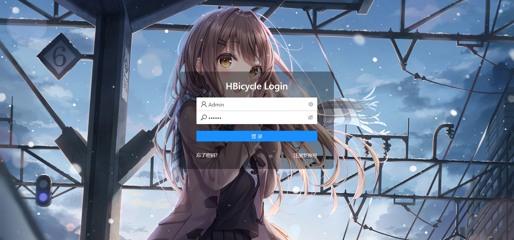
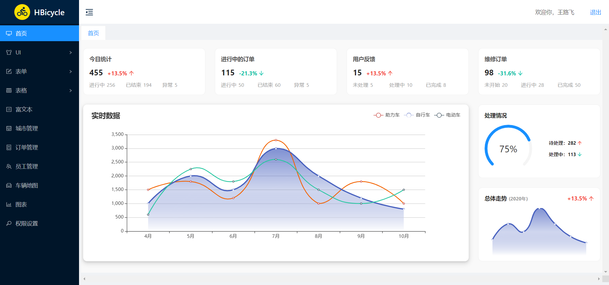

# HBicycle

从事前端开发以来主要做的都是以移动端为主的前端项目，想要挑战一下 PC 端的项目开发工作，想了很久却一直没有好的应用设计思路，偶然间看到[慕课网共享单车后台实战项目](http://imoocms.51purse.com/#/home)，就参照着页面设计，自己做了一下，权当学习了。

HBicycle 是一个使用 create-react-app 手脚架工具搭建的 React 共享单车后台管理项目，这是一个测试项目，用于提升并检验自己项目搭建与前端开发能力。目前已完成后台系统的主体静态界面结构搭建，该项目正在维护中，往后将引入 Redux、Redux-saga 并结合 EasyMock 实现接口模拟，覆盖 React 全家桶的全部学习，当前可体验版本为 [v0.0.1](https://humiao7.github.io/react-demo.github.io/#/) ，在线预览请点击 [Demo](https://humiao7.github.io/react-demo.github.io/#/).


## 特点

**此项目为 React 前端项目**

* 使用 [Antd](https://ant.design/index-cn) 完成主要功能界面开发
* 包含登录、菜单、Tab页签、UI、等主要板块内容展示
* 加入 [Echarts](https://echarts.apache.org/zh/index.html) 可视化图表展示功能
* 加入地图功能

## 目录

 - [如何开始](#如何开始)
 - [界面预览](#界面预览)
 - [文件结构](#文件结构)


## 如何开始

* 请先安装本地 [Node](https://nodejs.org/en/) 环境，要求 node 版本不低于 8.0.0
* 克隆地址: `git clone https://github.com/humiao7/react-demo.git`
* 项目使用 yarn 进行依赖管理，安装 yarn 工具: `npm install -g yarn` 
* 安装项目依赖: `yarn install`
* 构建本地运行环境: `yarn start`
* 打包生产环境代码: `yarn build`

## 界面预览

功能预览.

|                  登录界面                  |                主菜单界面                |
| :----------------------------------------: | :--------------------------------------: |
|  |  |


## 文件结构

```
react-demo/
│  .gitignore
│  package.json
│  README.md
│  yarn.lock
│      
├─build
├─public
│      favicon.ico
│      index.html
│      logo192.png
│      logo512.png
│      manifest.json
│      robots.txt
│      
├─scripts
├─src
│  │  App.css
│  │  App.js
│  │  index.js
│  │  
│  ├─api
│  ├─assets
│  ├─components
│  ├─modules
│  │  ├─login
│  │  │  │  index.js
│  │  │  │  
│  │  │  ├─api
│  │  │  ├─assets
│  │  │  │      background.jpg
│  │  │  │      
│  │  │  ├─components
│  │  │  └─style
│  │  │          login.css
│  │  │          
│  │  └─main
│  │      │  index.js
│  │      │  
│  │      ├─api
│  │      ├─assets
│  │      │      bicycle.svg
│  │      │      duck.jpg
│  │      │      
│  │      ├─components
│  │      ├─pages
│  │      │      basic-list.js
│  │      │      buttons.js
│  │      │      car-map.js
│  │      │      charts.js
│  │      │      citys.js
│  │      │      employees.js
│  │      │      home.js
│  │      │      loading.js
│  │      │      message.js
│  │      │      modal.js
│  │      │      notification.js
│  │      │      order-manage.js
│  │      │      permission.js
│  │      │      rich-text.js
│  │      │      senior-list.js
│  │      │      slide.js
│  │      │      
│  │      ├─router
│  │      └─style
│  │              basic-list.css
│  │              buttons.css
│  │              charts.css
│  │              home.css
│  │              loading.css
│  │              main.css
│  │              message.css
│  │              modal.css
│  │              notification.css
│  │              slide.css
│  │              
│  ├─router
│  │      index.js
│  │      
│  ├─style
│  └─utils
└─static
        login.png
        main.png
```